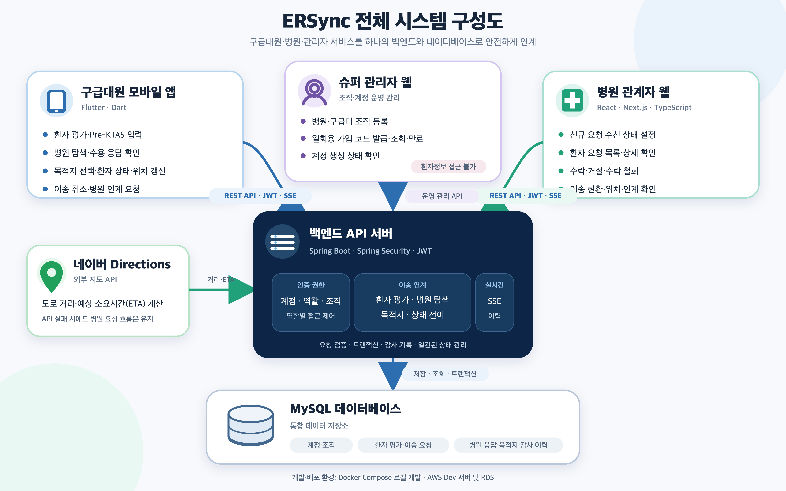

<!--
게시 위치: Hansung-ERsync/.github 공개 저장소의 profile/README.md
함께 게시할 이미지: assets/ersync-system-architecture.png → profile/assets/ersync-system-architecture.png
-->

# ERSync

### 구급 현장과 응급실을 잇다

환자 정보 전달부터 병원 수용 응답, 이송과 인계까지 함께 연결하는 응급환자 이송 협업 시스템

**한성대학교 · MVP 개발 프로젝트**

[구급대원 앱](https://github.com/Hansung-ERsync/ersync-front-app) · [병원·관리자 웹](https://github.com/Hansung-ERsync/ersync-front-web) · [백엔드](https://github.com/Hansung-ERsync/ersync-backend)

---

## 데모 영상

## 프로젝트 소개

응급환자 이송에는 환자의 현재 상태와 병원의 수용 가능 여부를 신속하게 공유하는 과정이 필요합니다.

ERSync는 구급대원이 입력한 환자 요약을 주변 응급실에 전달하고, 병원 응답을 한곳에 모아 목적지 선택을 돕습니다. 이송 중에도 목적지 병원과 최신 환자 상태·위치·예상 도착 시간을 공유해 현장에서 병원 인계까지의 흐름을 연결합니다.

> 현재 MVP를 개발하고 있습니다. 아래 기능은 서비스가 다루는 범위이며, 클라이언트 연동 현황은 각 저장소에서 확인할 수 있습니다.

## 서비스 한눈에 보기

| 사용자 | 사용하는 서비스 | 주요 기능 |
| :--- | :--- | :--- |
| **구급대원** | 모바일 앱 | 환자 상태 평가, 이송 요청, 병원 응답 확인, 목적지 선택, 이송 중 정보 갱신 |
| **병원 관계자** | 병원 웹 | 환자 요약 확인, 수락·거절·철회, 이송 현황 확인, 환자 인계 확인 |
| **슈퍼 관리자** | 관리자 웹 | 병원·구급대 조직 등록, 일회용 가입 코드 발급·관리 |

### 환자 평가부터 인계까지

- **병원 탐색** — 수신 가능한 주변 응급실을 찾고, 수락이 없으면 검색 반경을 단계적으로 넓힙니다.
- **목적지 선택** — 여러 병원이 수락할 수 있으며, 구급대원이 수락 병원 중 한 곳을 선택합니다.
- **이송 정보 공유** — 목적지 선택 이후의 환자 상태 갱신과 정확한 현재 위치는 현재 목적지 병원에 전달합니다.
- **인계 완료** — 구급대원의 완료 요청과 병원의 인계 확인이 모두 있어야 이송을 종료합니다.

## 시스템 구성도

이미지를 클릭하면 원본 크기로 확인할 수 있습니다.

### 기술 스택

| 영역 | 주요 기술 |
| :--- | :--- |
| 모바일 |  Flutter · Dart |
| 웹 |  React · TypeScript · Next.js App Router · Vinext |
| 백엔드 |  Java · Spring Boot · Spring Security · Spring Data JPA |
| 데이터·통신 |  MySQL · Flyway · REST API · SSE |
| 지도 |  NAVER Maps Directions API |
| 배포 구성 |  GitHub Actions · Cloudflare Workers · Docker · Nginx · AWS ECR / EC2 / RDS |

## 저장소

| 저장소 | 담당 서비스 |
| :--- | :--- |
| [**ersync-front-app**](https://github.com/Hansung-ERsync/ersync-front-app) | 구급대원용 Flutter 모바일 앱 |
| [**ersync-front-web**](https://github.com/Hansung-ERsync/ersync-front-web) | 병원 웹과 슈퍼 관리자 웹을 관리하는 모노레포 |
| [**ersync-backend**](https://github.com/Hansung-ERsync/ersync-backend) | 공통 API, 인증·권한, 이송 상태 관리, 병원 탐색, 실시간 알림 |

## 개발 팀

| 이름 | GitHub | 담당 역할 |
| :--- | :--- | :--- | :--- |
| **김민서** | [@eric91405](https://github.com/eric91405) | 팀장 · 웹 프론트엔드 · 디자인 |
| **김병철** | [@ldzb](https://github.com/ldzb) | 백엔드 |
| **김현섭** | [@hyunseop827](https://github.com/hyunseop827) | 백엔드 · DevOps |
| **최원재** | [@chldnjswo](https://github.com/chldnjswo) | 모바일 앱 · 디자인 | 

## 설계 원칙

- **현장의 선택을 지원합니다.** 병원은 수용 가능 여부를 판단하고, 구급대원은 목적지를 선택합니다.
- **필요한 정보만 공유합니다.** 환자 이름·주민등록번호·연락처를 수집하지 않으며, 슈퍼 관리자는 환자 임상정보와 위치정보를 조회할 수 없습니다.
- **변화의 이력을 보존합니다.** 이송 중 환자 평가는 새 기록으로 추가하고, 위치는 전체 이동 경로 대신 최신 위치만 유지합니다.

## 프로젝트 문서

[MVP 요구사항](https://github.com/Hansung-ERsync/ersync-backend/blob/main/docs/project/mvp-requirements.md) · [개발 컨벤션](https://github.com/Hansung-ERsync/ersync-backend/blob/main/docs/conventions.md) · [프론트엔드 연동 문서](https://github.com/Hansung-ERsync/ersync-backend/tree/main/docs/handoffs)
